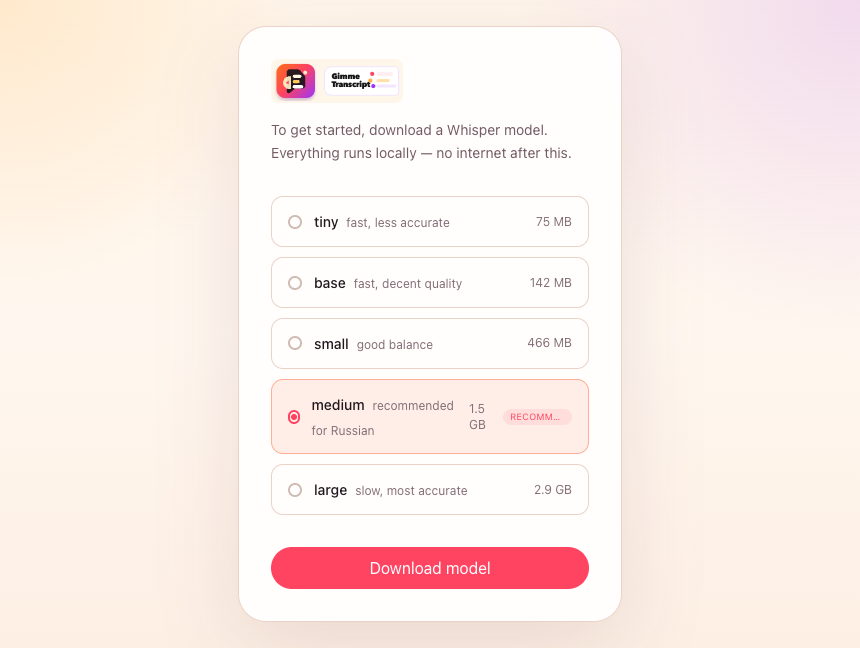
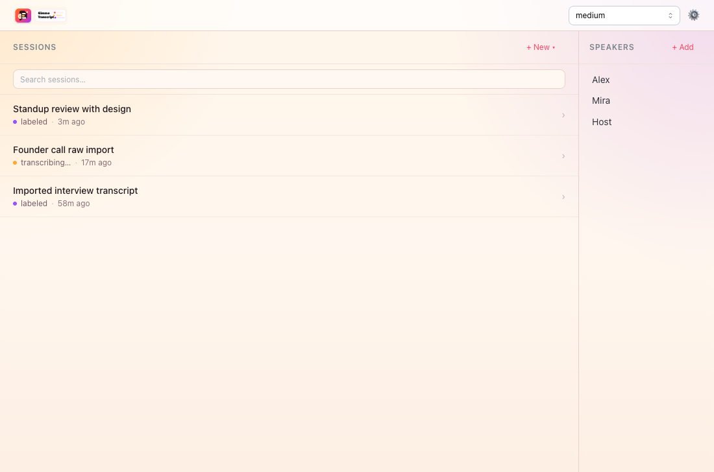
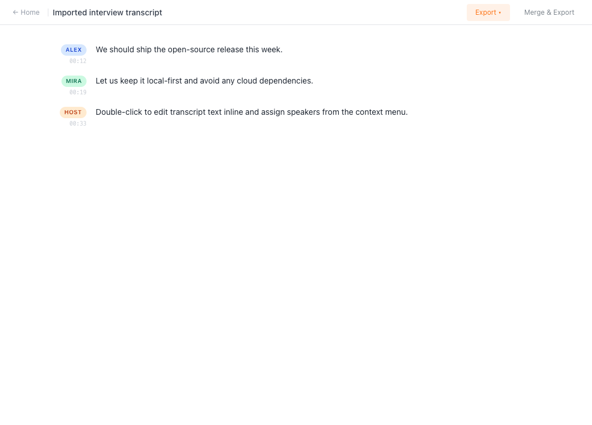
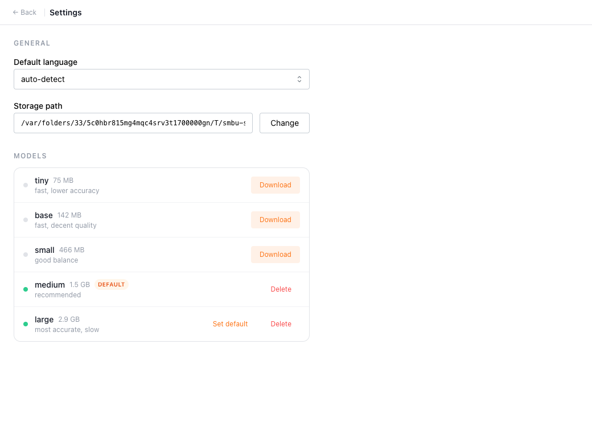

# Gimme Transcript


## Local desktop transcription for multi-speaker audio. No cloud, no API keys, no data leaves your machine.

`Gimme Transcript` is an Electron app built around `whisper.cpp`:

- import one or more audio files
- transcribe locally with Whisper models
- label speakers manually per segment or in bulk
- export clean transcripts as Markdown or plain text

The project is macOS-first for MVP. Linux and Windows build configs exist in the repo, but they are not the primary supported targets yet.

## Why this exists

Most tools that handle multi-speaker meeting transcripts well are paid, cloud-based, or both. This project is meant to stay:

- local-first
- free and open source
- usable without subscriptions
- simple enough to run on a normal desktop

## Features

- local transcription via bundled `whisper.cpp`
- streaming transcript segments into the UI while transcription runs
- manual speaker labeling with a reusable global speaker list
- bulk speaker assignment for multiple transcript segments
- per-session local JSON storage
- export to Markdown and plain text
- downloadable Whisper models from inside the app
- custom storage path support

## Screenshots






## Tech Stack

- Electron
- Electron Vite
- React
- Mantine
- Tailwind CSS
- TypeScript (`strict`)
- `whisper.cpp`

## Project Status

MVP is implemented according to the current task list in [tasks.md](./tasks.md). The app is still early-stage and should be treated as a fast-moving desktop project rather than a stable end-user release.

## Development

### Prerequisites

- Node.js 20+
- npm 10+
- macOS for the primary development path
- `cmake` toolchain if you need to build the Whisper binary locally

### Install

```bash
npm install
```

### Run in development

```bash
npm run dev
```

### Checks

```bash
npm run format:check
npm run lint
npm run typecheck
```

### Build

```bash
npm run build
npm run build:mac
```

### Regenerate screenshots

```bash
npm run screenshots
```

## Whisper Models

The app downloads Whisper models into the app data directory on first use.

Default locations:

- sessions: `{AppData}/sessions/{uuid}.json`
- speakers: `{AppData}/speakers.json`
- settings: `{AppData}/settings.json`
- models: `{AppData}/models/`

On macOS, the default app data base path is:

```text
~/Library/Application Support/Gimme Transcript/
```

The app also supports overriding the storage path in settings.

## Repository Layout

```text
src/
  main/       Electron main process, IPC, storage, Whisper integration
  preload/    typed Electron bridge
  renderer/   React UI
resources/
  whisper.cpp/ bundled binaries
scripts/
  build-whisper.mjs
  capture-screenshots.mjs
docs/branding/
  logo-variants/ final selected branding assets
docs/screenshots/
  real Playwright-driven app screenshots used in the README
```

## Contributing

Contributions are welcome, but keep changes aligned with the project constraints in [AGENTS.md](./AGENTS.md), [spec.md](./spec.md), and [tasks.md](./tasks.md).

Start here:

- [CONTRIBUTING.md](./CONTRIBUTING.md)
- [CODE_OF_CONDUCT.md](./CODE_OF_CONDUCT.md)
- [SECURITY.md](./SECURITY.md)

## License

MIT. See [LICENSE](./LICENSE).
